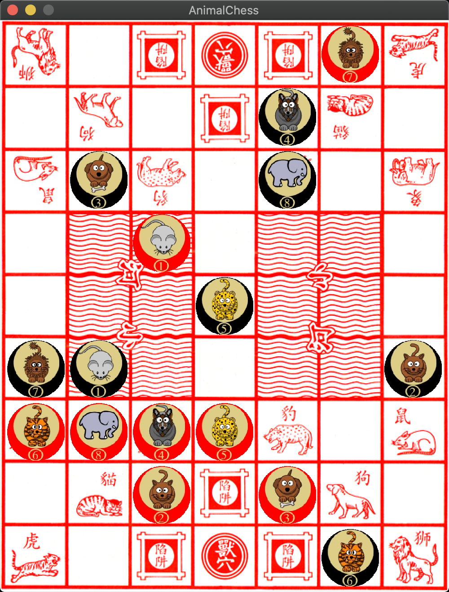

## 斗兽棋
用rust实现的斗兽棋,使用Alpha-Beta-Pruning算法，并实现AlphaZero算法进行训练。



## 玩法规则
一方成功进入对方兽穴.
斗兽棋是中国一种棋类游戏，双方有八只棋子，依大小顺序为象、狮、虎、豹、狼、犬、猫、鼠。
较大的可吃较小的，同类可以互吃，而鼠则可吃象，象不能吃鼠。
动物走一格，前后左右都可以。两者相同的相遇，执下一步棋的可吃对方而并不会与对方同归于尽
1：如果一方进入了对方的兽穴便胜出。
2：任何一方都不能进入自己的兽穴。
3：如果对方的兽类走进陷阱，己方任何一只兽都可以把它吃掉。
4：如果敌兽进入陷阱，一回合后，自己的兽类不吃掉陷阱中的敌兽，当对方进入己方兽穴时，则本方输。
5：中间有两条小河（跟湖差不多），狮、虎可以横直方向跳过河，直接把对岸的动物吃掉。
6：只有鼠可以下水，在水中的鼠可以阻隔狮、虎跳河。
7：两鼠在水内可以互吃。
## How To Run
It need rust nightly version.

### Prerequisite
```
$ rustup default nightly
```

### Play
```
$ git clone https://github.com/netcan/AnimalChess.git
$ cd AnimalChess
$ cargo run --release
```

### Developing
```
$ sudo apt-get install python3-dev python-dev
$ pip3 install virtualenv ipython
$ cd pymodule
$ virtualenv venv
$ source venv/bin/activate
(venv) $ pip install -r requirements.txt
(venv) $ maturin develop
(venv) $ ipython
In [1]: import animal_chess_pymodule

In [2]: board = animal_chess_pymodule.Board('l5t/1d3c1/r1p1w1e/7/7/7/E1W1P1R/1C3D1/T5L w - - 0 1')

In [3]: board
Out[3]:
l #@# t
 d # c
r p w e
 ~~ ~~
 ~~ ~~
 ~~ ~~
E W P R
 C # D
T #@# L

In [4]: board.generate_all_steps()
Out[4]:
[24688,
 24673,
 24656,
 25202,
 25187,
 25185,
 25716,
 25701,
 25699,
 26230,
 26198,
 26213,
 29057,
 29042,
 29025,
 29040,
 30085,
 30070,
 30053,
 30068,
 32897,
 32880,
 34422,
 34437]

In [5]: board.move_chess(24688)

In [6]: board
Out[6]:
l #@# t
 d # c
r p w e
 ~~ ~~
 ~~ ~~
 ~~ ~~
  W P R
EC # D
T #@# L
```

